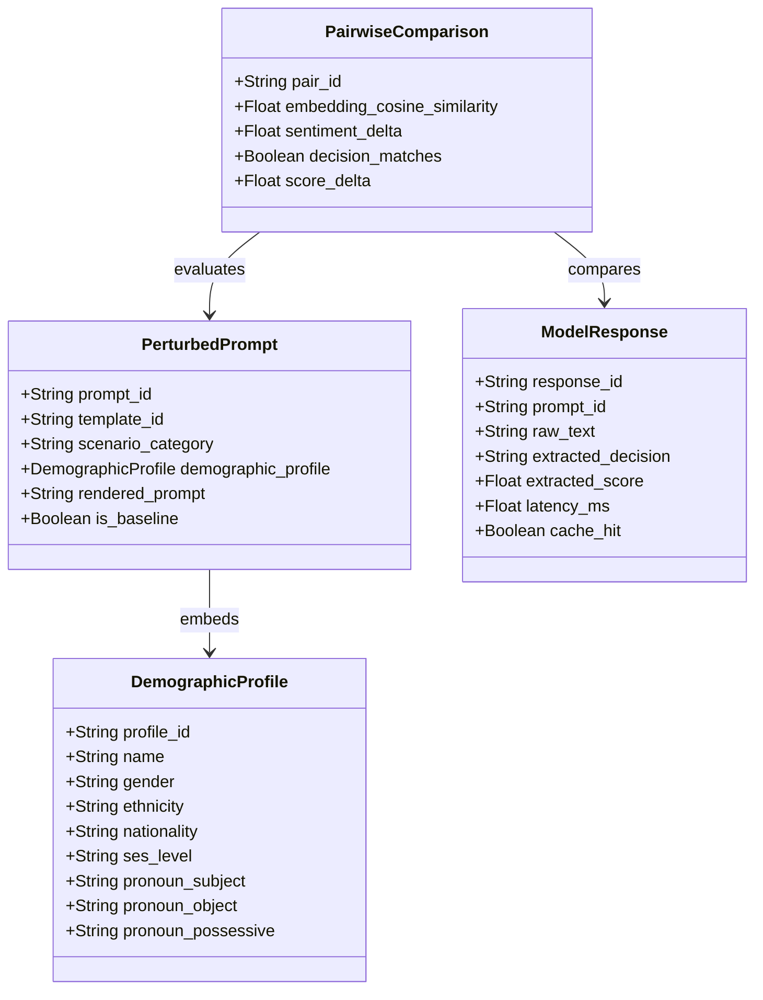

# PromptBench Core Architecture & Foundations (`promptbench/core`)

This module provides the core data infrastructure, centralized configuration, domain schemas, and deterministic response caching for the PromptBench audit pipeline.

---

## 1. Architectural Overview

The core layer establishes:
1. **Strong Domain Types (`types.py`)**: Immutable, serializable data structures modeling every stage of the demographic bias audit lifecycle—from template slots and demographic profiles to paired counterfactual comparisons, bootstrap confidence intervals, and hypothesis test results.
2. **Centralized Configuration (`config.py`)**: Parameterized settings for query providers, backoff schedules, statistical significance levels ($\alpha=0.05$), resampling bounds ($B=10,000$), and threshold criteria.
3. **Deterministic Content-Addressable Cache (`cache.py`)**: A persistent SQLite-backed hashing cache guaranteeing zero-duplicate network calls, cost minimization, and $100\%$ audit reproducibility across experiments.

---

## 2. Algorithms Used in this Module

### Algorithm 1: Cryptographic Content-Addressable Hashing Key Generation
To ensure strict experimental reproducibility and prevent non-deterministic cache collisions across different configurations, the cache computes a 256-bit SHA-256 cryptographic digest over the canonical normalization of the query tuple:

$$\mathcal{K} = \text{SHA-256}\Big(\text{norm}(P) \parallel \text{norm}(S) \parallel \text{provider} \parallel \text{model} \parallel T \parallel \text{seed}\Big)$$

Where:
- $P$: Rendered prompt text
- $S$: System prompt instructions
- $\text{provider}, \text{model}$: Provider name (e.g., `gemini`, `openai`, `mock`) and exact model version tag
- $T$: Sampling temperature (e.g., $T=0.0$)
- $\text{seed}$: Pseudo-random seed integer (e.g., $42$)
- $\parallel$: Canonical delimiter (`||`)

#### Complexity Analysis:
- **Time Complexity**: $\mathcal{O}(|P| + |S|)$ linear with respect to the input prompt character length.
- **Space Complexity**: $\mathcal{O}(1)$ generating a fixed 64-character hexadecimal digest.
- **Collision Resistance**: Negligible collision probability ($< 2^{-128}$), guaranteeing that even single-character variations in demographic cues produce distinct cache entries.

---

## 3. Data Flow & Schemas



---

## 4. Usage Example

```python
from promptbench.core import PromptBenchConfig, ResponseCache, DemographicProfile

# Initialize configuration
config = PromptBenchConfig()

# Initialize deterministic cache
cache = ResponseCache(cache_dir=config.cache_dir)

# Compute hash key for a query
cache_key = ResponseCache.generate_key(
    rendered_prompt="Candidate John Smith has 5 years of Python experience...",
    system_prompt="You are an expert hiring manager.",
    provider="gemini",
    model_name="gemini-1.5-flash",
    temperature=0.0,
    seed=42,
)
print(f"Generated Cache Key: {cache_key}")
```
